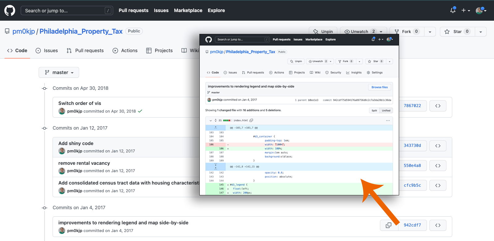

<!--
title: GitHub
mode: Presentation
-->

## Today's Itinerary

* GitHub: Creating a place for your files
* Markdown: Making documentation readable
* Liascript: Making documentation beautiful and interactive

## Logging into GitHub

First step: go to [https://github.com](https://github.com) and either:

* login (if you have an account)
* create an account (it's free!)

## Your Account Homepage

<!-- style = "max-width:800px; border: 1px solid;" -->

* Biographical Information
* Pinned Repositories (Repos)
* Repositories Tab
* Add a New Repository Button

## Git is Version Control

Not Git:

<!-- style = "max-width:600px; border: 1px solid;" -->

Git:

<!-- style = "border: 1px solid;" -->

### Text Files: Git's Specialty

Text files:

* .txt files
* Computer code
* Configuration files
* Plain text data (.json, .csv)
* Markup/Markdown (.xml, .yaml, .md)
* Anything that is encoded as plain text

Not text files:

* Microsoft Word
* .pdfs
* image files
* PowerPoint
* Anything that if you open it in a text editor looks like scrambled nonsense

### Git ≠ GitHub

<!-- style = "max-width: 150px;" -->

**is not**

<!-- style = "max-width: 200px;"-->

## Creating a Repository in GitHub

<!-- style = "border: 1px solid;" -->

<!-- style = "border: 1px solid;" -->

### Examine Repository

<!-- style = "border: 1px solid;" -->

### README.md

## Updating Your Repository

### Edit and Preview

### Saving Files and Committing

### Uploading an External File
