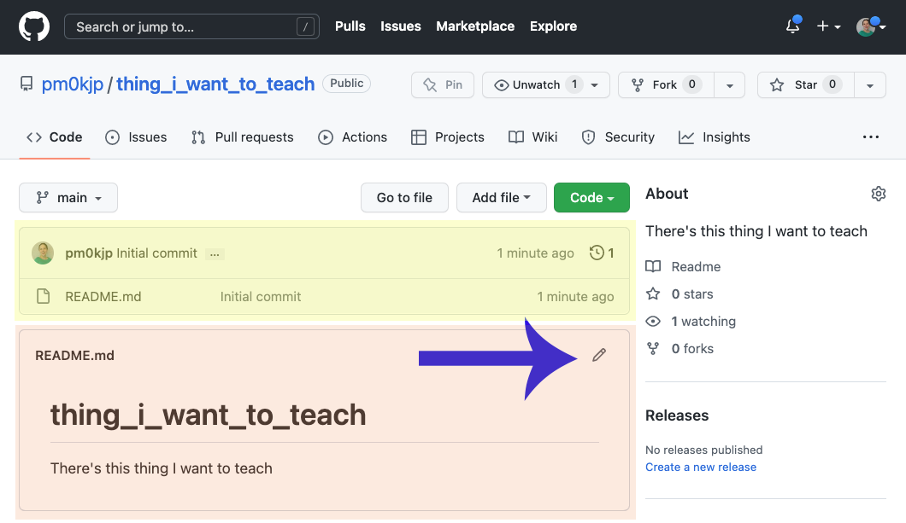
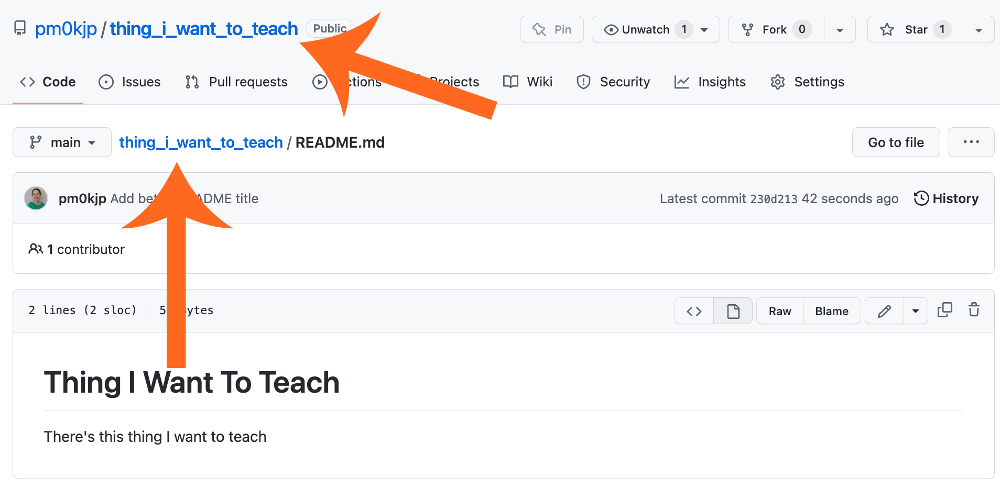
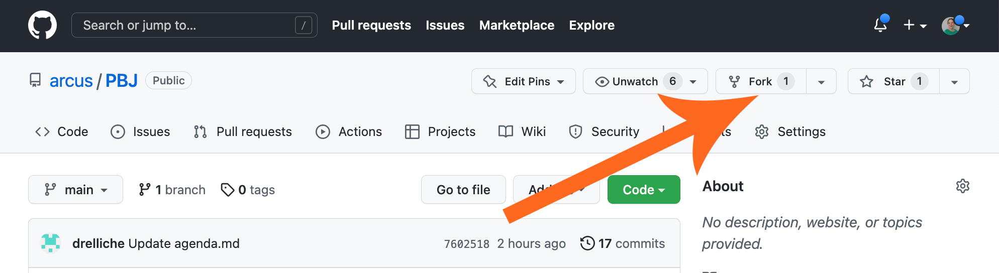

<!--
title: GitHub
mode: Presentation
-->

## Today's Itinerary

* GitHub: Creating a place for your files
* Markdown: Making documentation readable
* Liascript: Making documentation beautiful and interactive

## GitHub

* Logging in
* Creating a new repository (repo)
* Forking an existing repo

### Logging into GitHub

First step: go to [https://github.com](https://github.com) and either:

* Login (if you have an account)
* Create an account (it's free!)

#### Your Account Homepage

<!-- style = "max-width:800px; border: 1px solid;" -->

* Biographical Information
* Pinned Repositories (Repos)
* Repositories Tab
* Add a New Repository Button

#### Git is Version Control

Primitive Version Control (look familiar?)

<!-- style = "max-width:600px; border: 1px solid;" -->

#### Git is Version Control

Git Version Control:

<!-- style = "border: 1px solid;" -->

#### Text Files: Git's Specialty

Text files:

* .txt files
* Computer code
* Configuration files
* Plain text data (.json, .csv)
* Markup/Markdown (.xml, .yaml, .md)
* Anything that is encoded as plain text

Not text files:

* Microsoft Word
* .pdfs
* image files
* PowerPoint
* Anything that if you open it in a text editor looks like scrambled nonsense

#### Git ≠ GitHub

<!-- style = "max-width: 150px;" -->

**is not**

<!-- style = "max-width: 200px;"-->

GitHub represents git processes in a nicer-looking way and adds its own bells and whistles.  It's not the only company or website that works really well with git!

### Creating a Repository in GitHub

<!-- style = "border: 1px solid;" -->

<!-- style = "border: 1px solid;" -->

#### Examine Repository

<!-- style = "border: 1px solid;" -->

#### README.md

<!-- style = "max-width:600px; border: 1px solid;" -->

#### README.md

<!-- style = "max-width:600px; border: 1px solid;" -->

#### Updating Your Repository

<!-- style = "max-width:300px; border: 1px solid;" -->

<!-- style = "max-width:600px; border: 1px solid;" -->

#### Edit and Preview

<!-- style = "max-width:600px; border: 1px solid;" -->

#### Saving Files and Committing

<!-- style = "max-width:600px; border: 1px solid;" -->

#### Getting Back to Repository View

<!-- style = "max-width:600px; border: 1px solid;" -->

#### Uploading an External File

### Forking an Existing Repository

<!-- style = "max-width:600px; border: 1px solid;" -->

<!-- style = "max-width:600px; border: 1px solid;" -->

#### Looking at Your Fork

<!-- style = "max-width:600px; border: 1px solid;" -->
