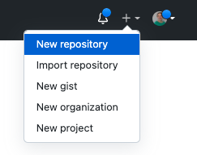
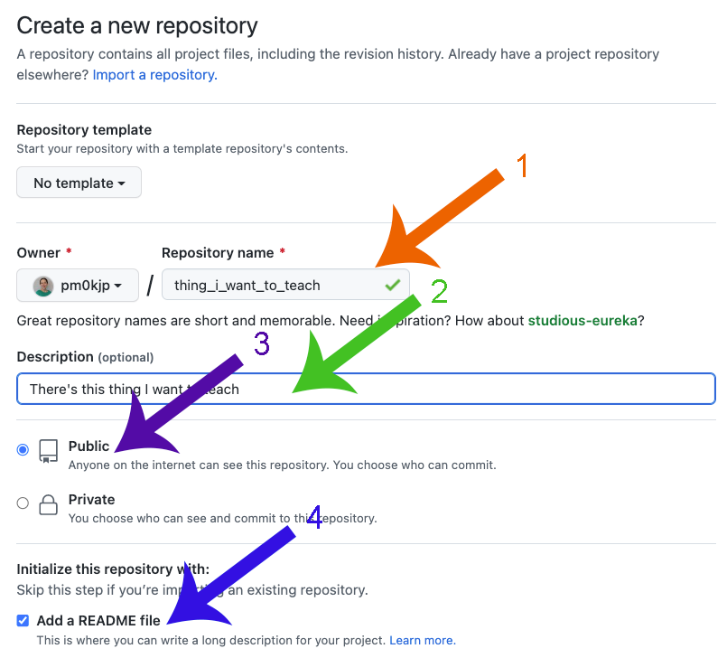
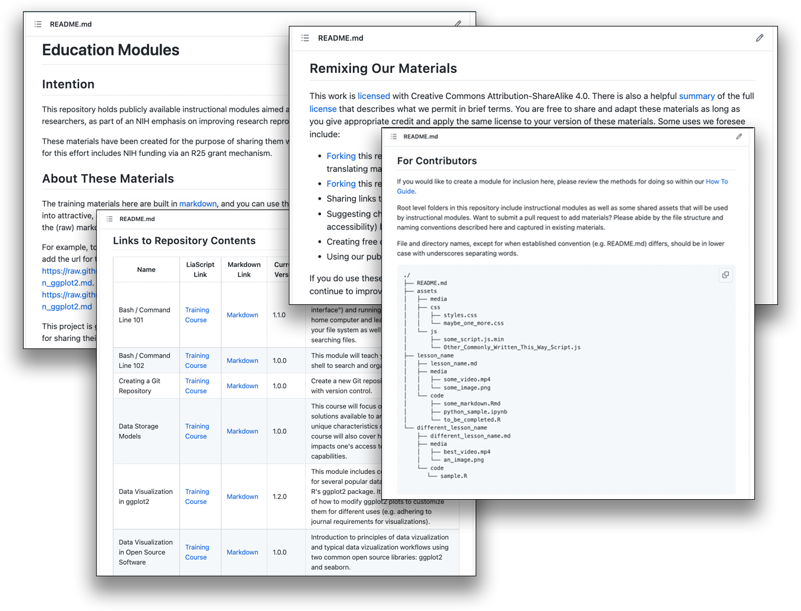
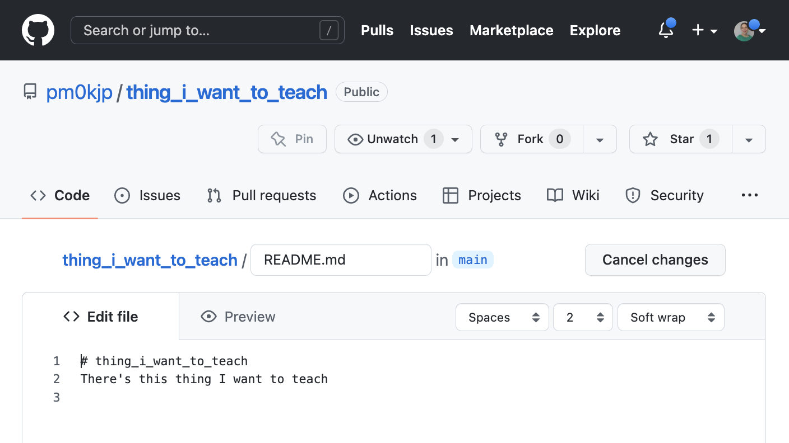
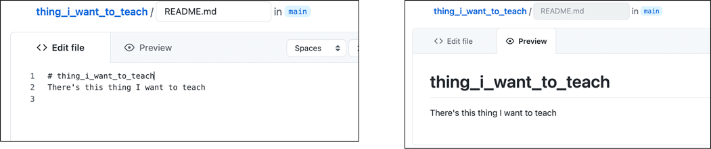
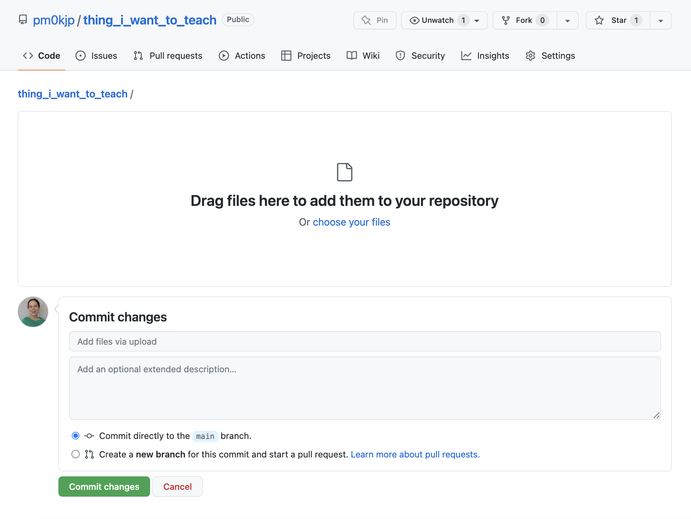
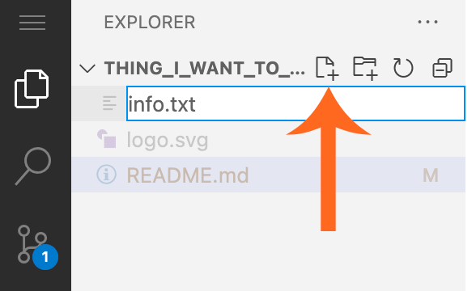
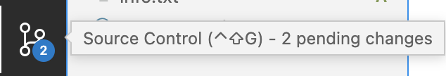
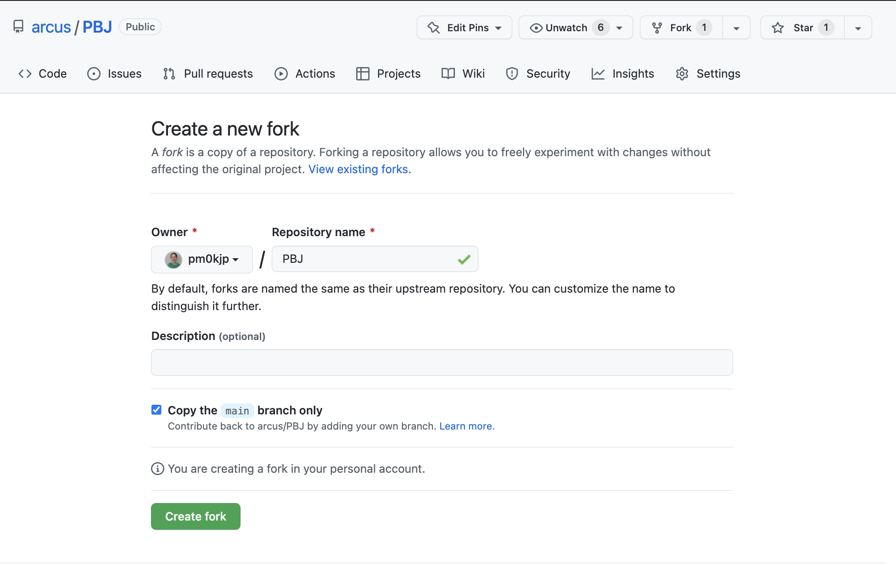

<!--
title: GitHub
mode: Presentation
-->

## Today's Itinerary

* GitHub: Creating a place for your files
* Markdown: Making documentation readable
* Liascript: Making documentation beautiful and interactive

## GitHub

* Logging in
* Creating a new repository (repo)
* Forking an existing repo

### Logging into GitHub

First step: go to [https://github.com](https://github.com) and either:

* Login (if you have an account)
* Create an account (it's free!)

#### Your Account Homepage

<!-- style = "max-width:800px; border: 1px solid;" -->

#### Version Control

Primitive Version Control (look familiar?)

<!-- style = "max-width:600px; border: 1px solid;" -->

#### Git Version Control

Git Version Control:

<!-- style = "max-width:800px; border: 1px solid;" -->

#### Text Files: Git's Specialty

Text files:

* .txt files
* Computer code
* Configuration files
* Plain text data (.json, .csv)
* Markup/Markdown (.xml, .yaml, .md)
* Anything that is encoded as plain text

Not text files:

* Microsoft Word
* .pdfs
* image files
* PowerPoint
* Anything that if you open it in a text editor looks like scrambled nonsense

#### Git ≠ GitHub

<!-- style = "max-width: 150px;" -->

**is not**

<!-- style = "max-width: 200px;"-->

GitHub represents git processes in a nicer-looking way and adds its own bells and whistles.  It's not the only company or website that works really well with git!

### Creating a Repository in GitHub

<!-- style = "max-width:200px; border: 1px solid;" -->  
<!-- style = "max-width:600px; border: 1px solid;" -->  

#### Examine Repository

<!-- style = "max-width:800px; border: 1px solid;" -->

#### README.md Example 1

<!-- style = "max-width:800px;" -->

#### README.md Example 2

<!-- style = "max-width:800px; border: 1px solid;" -->

#### Updating Your Repository: First Method

<!-- style = "max-width:400px; border: 1px solid;" -->  
<!-- style = "max-width:600px; border: 1px solid;" -->  

#### Edit and Preview: First Method

<!-- style = "max-width:900px;" -->

#### Saving Files and Committing: First Method

<!-- style = "max-width:10 00px;" -->

#### Getting Back to Repository View

<!-- style = "max-width:800px; border: 1px solid;" -->

#### Adding a File: First Method

<!-- style = "max-width:400px; border: 1px solid;" -->  
<!-- style = "max-width:400px; border: 1px solid;" -->  

#### Updating Your Repository: Second Method

<!-- style = "max-width:500px; border: 1px solid;" -->  
<!-- style = "max-width:500px; border: 1px solid;" -->  

#### Edit and Preview: Second Method

<!-- style = "max-width:800px; border: 1px solid;" -->  

<!-- style = "max-width:800px; border: 1px solid;" -->  

#### Adding a File: Second Method

<!-- style = "max-width:300px; border: 1px solid;" -->  
<!-- style = "max-width:600px; border: 1px solid;" -->  

#### Saving Files and Committing: Second Method

<!-- style = "max-width:400px; border: 1px solid;" -->  <!-- style = "max-width:400px; border: 1px solid;" -->  

#### Get Back to GitHub

To get back to your normal GitHub repository, you can either change ".dev" to ".com" in the URL, or you can click on the "burger" menu (three lines) in the upper left and choose "Go To Repository".

<!-- style = "max-width:500px; border: 1px solid;" -->

### Forking an Existing Repository

<!-- style = "max-width:500px; border: 1px solid;" -->  <!-- style = "max-width:500px; border: 1px solid;" -->  

#### Looking at Your Fork

<!-- style = "max-width:500px; border: 1px solid;" -->
