<!--
title: GitHub
mode: Presentation
narrator: US English Female
version:  0.1.0
-->

## Today's Itinerary

--{{0}}--
Hi everyone, we'd like to go over today's itinerary.  We have 90 minutes and we have no break scheduled.  Everything we do today can be done in the browser, so you don't need any special software installed.  We're also going to make sure you know where to go to get our materials so if you want to go back over what we talked about, you have access to the materials later.

--{{1}}--
We're going to start off talking about GitHub.  I will lead that effort, and my name is Joy Payton.  I lead data science education efforts in the Research Institute of the Children's Hospital of Philadelphia.

--{{2}}--
Then my colleague Elizabeth Drellich will take on the topic of Markdown.

--{{3}}--
Finally, André Dietrich will present Liascript. André started to develop LiaScript as a side-project to simplify the development of educational content originally within the industrial eLab project, in which they tried to make universitary hardware/experiments accessible to students 24/7. Liascript, by the way, is what you see here on your screen.

Follow along: https://bit.ly/amia-liascript

{{1}}
* GitHub: Creating a place for your files (Joy Payton)
{{2}}
* Markdown: Making documentation readable (Elizabeth Drellich)
{{3}}
* Liascript: Making documentation beautiful and interactive (André Dietrich)

## GitHub

--{{0}}--
So, let's get started with GitHub.  We'll cover three tasks today to get you started: logging in, creating a new repository or repo, and forking an existing repo.

* Logging in
* Creating a new repository (repo)
* Forking an existing repo

### Logging into GitHub

First step: go to [https://github.com](https://github.com) and either:

* Login (if you have an account)
* Create an account (it's free!)

--{{0}}--
GitHub is a website that provides storage for git repositories (we'll explain this a bit more) as well as some helpful add-ons that are often used by software developers.  You may or may not use these helpful add-ons such as issues, pull requests, projects, etc.

#### Your Account Homepage

--{{0}}--
Let's take a look at some of what you might see on your Git account homepage.  Here is my GitHub account homepage!

--{{1}}--
* In the yellow highlighted area, you can see biographical information, which you can optionally add if you want.

--{{2}}--
* In the purple box, here are some of my pinned repositories, which are the ones I want easily visible for fast access.  A repository is a directory of files all related to a single project.  

--{{3}}--
* In green, at the top, we see the "Repositories" tab, where I can see all 59 of my repositories.

--{{4}}--
* And finally, if you follow the orange arrow on the right side, you can see a plus button which will allow me to add a new repository.

--{{5}}--
If you think of the word *hub* as referring to a central place for something, you might realize that "GitHub" is a central place for "git".  But... what's git?  Before we start diving into this website, what is it all about?

{{0-1}}
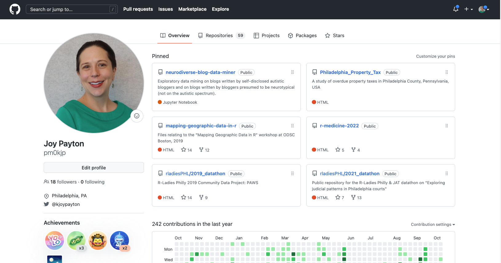<!-- style = "max-width:800px; border: 1px solid;" -->

{{1-2}}
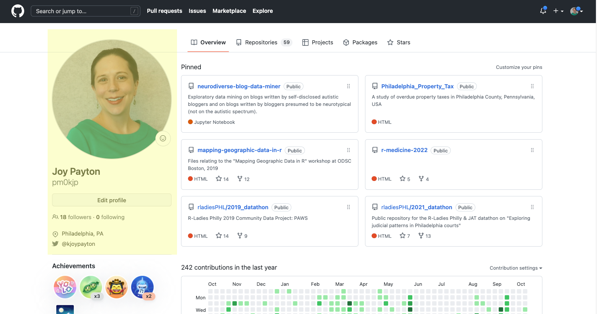<!-- style = "max-width:800px; border: 1px solid;" -->

{{2-3}}
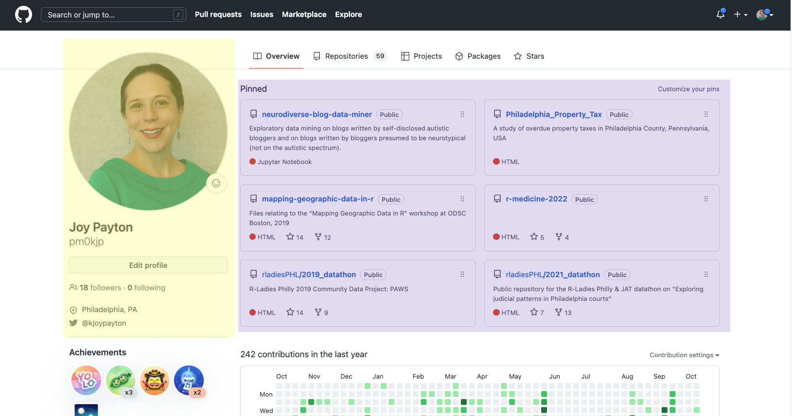<!-- style = "max-width:800px; border: 1px solid;" -->

{{3-4}}
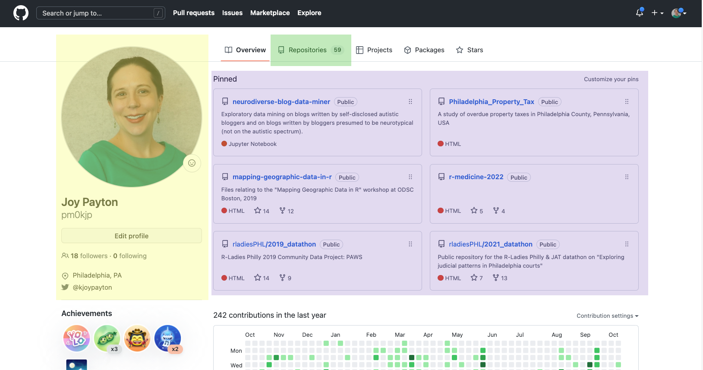<!-- style = "max-width:800px; border: 1px solid;" -->

{{4}}
<!-- style = "max-width:800px; border: 1px solid;" -->

#### Version Control

--{{0}}--
Git is the technical industry standard for version control.  Version control exists in order to give you access to any version of a text file (usually code or configuration files) at any time, with helpful messages that tell you why things changed and by whom. Often, a scientist's first form of version control is something like this first image:

--{{1}}--
If you have a file system that looks like this, with clues embedded in file names, you have a crude (and large, and hard to work with) version control system already. You probably have to say things like "no, it's the one with the time stamp in March, remember, because in April that was the one that says 'final' but it's not really …". Maybe you're afraid to throw any of the files away because you're not 100% sure you remember exactly why you made that particular version, but you're a little chagrined that you have 10 versions of (mostly) the same .csv. If your files are large, you might have a storage problem as well!

--{{2}}--
And what about your clinical or research collaborators? Are you sending these files back and forth over email for each member to make changes? What if someone accidentally works on a version that doesn't include the changes of another collaborator? Working by committee is hard when you rely on local copies. Maybe you have just one copy on a server that everyone has access to, which is better. But while you have the file open, your assistant or co-PI can't make changes. Frustrating!

Primitive Version Control (look familiar?)

{{1}}
<!-- style = "max-width:600px; border: 1px solid;" -->

#### Git Version Control

--{{0}}--
Good news! There is a better way to do version control. While there are several methods out there (like Subversion), Git has won the market.

--{{1}}--
Git helps you track changes in your text files.  Specifically, Git will help you track the version of your files and keep records of:

--{{2}}--
What changed, When it changed, Who changed it, and Why they changed it.  Here you can see a little picture of me that shows that I, pm0kjp, changed the code, and the date I changed it, and a bit of description as to why I changed the code.  When I click on one of the changes, the blue codes on the far right, I can see the actual changes to the code, with new lines shown in green and removed lines shown in red.

--{{3}}--
Not only does Git keep a record of this, but it allows you to go back in time and recapture things you deleted or changed and now have second thoughts about.  This is great because it keeps you from hoarding multiple versions of a file, which fill up your hard drive and also give you heartburn when you have to comb through them to find that one thing you are looking for.

--{{4}}--
Now, earlier, we said that Git helps track changes in **text** files.  What did we mean by that?

Git Version Control:

{{1}}
<!-- style = "max-width:800px; border: 1px solid;" -->

#### Text Files: Git's Specialty

--{{0}}--
Git does its best work when you track changes in your **text** files.  By "text" here we mean files that are encoded in plain text, like .txt files, computer code like Python files, configuration files, data files like .json and markdown/markup files like .xml or .yaml.  

--{{1}}--
Specially formatted "word processing" documents like Microsoft Word or .pdf documents aren't encoded in plain text and aren't "text files" in this sense.  Why does this matter?

--{{2}}--
Because while Git can tell exactly what line and what characters changed in a text file, and highlight those changes so you can see easily what changed, Git cannot do that level of specificity for non-text files.  If you have an image or a PowerPoint slide deck, and you put that in a Git repository, it can only tell you *that* it changed, and by whom, and their message for why it changed.  It can't tell you, say, that you added two extra slides, or that the image now is in black and white instead of color.

Text files:

* .txt files
* Computer code
* Configuration files
* Plain text data (.json, .csv)
* Markup/Markdown (.xml, .yaml, .md)
* Anything that is encoded as plain text

{{1}}
<section>
Not text files:

* Microsoft Word
* .pdfs
* image files
* PowerPoint
* Anything that if you open it in a text editor looks like scrambled nonsense

</section>

#### Git ≠ GitHub

--{{0}}--
<section>
Git is not GitHub, although the two concepts are closely linked.

"git" is a version control system and command line program. You don't need to access a website to use it.  You can use it by itself and do everything you need to, if you're comfortable working on the command line. Lots of people do just that!

While Git by itself is great at version control and keeping track of your changes, **GitHub** wraps all of the sometimes complex inner workings of Git into a visually pleasing, easy to understand user interface.  **GitHub** is a company that has done a good job of making tools that work with git, but GitHub and git are distinct products, maintained by different organizations.  You may want to learn more about git itself, or you might want to investigate other products that are GitHub competitors, like BitBucket.  That being said, we're going to teach you some things about GitHub today, because we think that's a good way to start thinking about these ideas for the first time.

Instead of having to learn a bunch of command line tools, GitHub (both the website as well as the client software you can run on your computer) allows you to see things like version history, file change summaries, etc., very simply. It's fairly intuitive for most day-to-day uses.

GitHub (the website) is a also place for your files to live with version control applied to them, so you can think of it as a souped-up remote server. That means it's great not only for version control (which you could just do on your local computer using a git-enabled product like GitHub Desktop), but also having a central hub for all your files that you and your collaborators can use as the canonical source of the best, most up-to-date files.

</section>

<!-- style = "max-width: 150px;" -->

**is not**

<!-- style = "max-width: 200px;"-->

GitHub represents git processes in a nicer-looking way and adds its own bells and whistles.  It's not the only company or website that works really well with git!

### Creating a Repository in GitHub

--{{0}}--
The first thing we're going to do is to create a new repository.  Please do these steps, as each step of this workshop builds on previous steps.  

--{{1}}--
Begin by clicking on the plus button in the upper right and choose "New Repository".  A repository is a directory of files that is version controlled using git.  So a repository can hold one or many files that you want to track changes on across the life of your work.

--{{2}}--
Then, please look at all of these arrows and follow along.  Give your repository a name, without spaces, where you see in the image the orange arrow labeled with the number 1.  Maybe you already have a topic idea that you want to create education around, so you can name it something that makes sense for your purposes.  Or you can give it a silly name like test-repository.

--{{3}}--
In the second box, where you see the green arrow and the number 2, give a brief description.  You can always change this later, so don't overthink it.

--{{4}}--
In the third step, make sure this repository is public.  This is a requirement for using liascript, so please be aware that the things you write in your repository will be publicly accessible... don't put company secrets there!

--{{5}}--
Finally, as a fourth step, click the "Add a README file" box to check it.  Then click the green "Create Repository" button at the bottom of the form.

{{0-2}}
<section>
<!-- style = "max-width:200px; border: 1px solid;" -->  
</section>

{{2-3}}
<section>
<!-- style = "max-width:200px; border: 1px solid;" -->
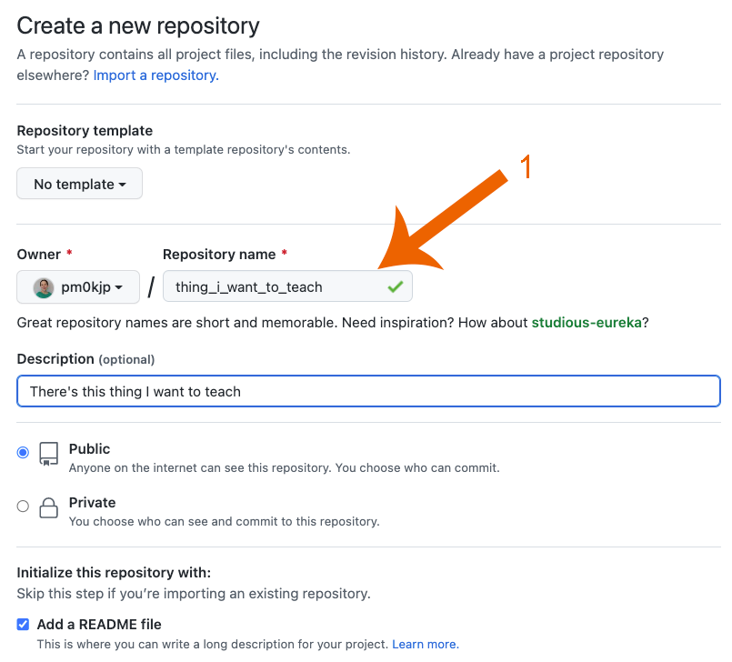<!-- style = "max-width:600px; border: 1px solid;" -->  
</section>

{{3-4}}
<section>
<!-- style = "max-width:200px; border: 1px solid;" -->
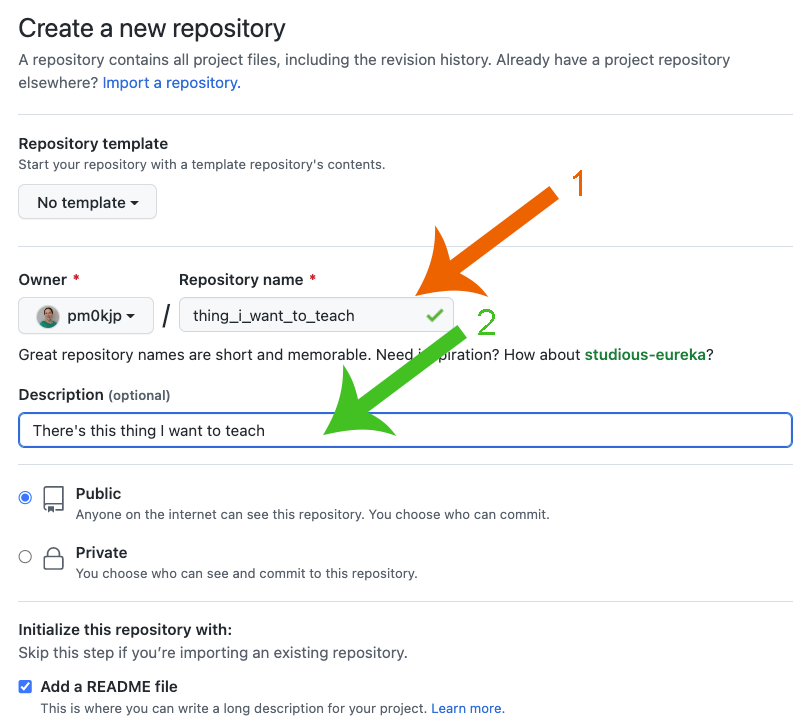<!-- style = "max-width:600px; border: 1px solid;" -->
</section>

{{4-5}}
<section>
<!-- style = "max-width:200px; border: 1px solid;" -->
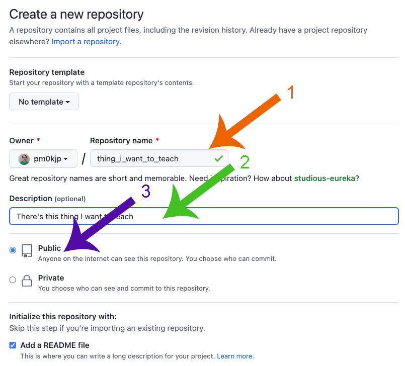<!-- style = "max-width:600px; border: 1px solid;" -->  
</section>

{{5}}
<section>
<!-- style = "max-width:200px; border: 1px solid;" -->
<!-- style = "max-width:600px; border: 1px solid;" -->  
</section>

#### Examine Repository

--{{0}}--
When you look at your new repository, I want to draw your attention to three things.  At the top, highlighted here in yellow, is a file listing of your repository.  Currently, there's just one file listed there: README.md.

--{{1}}--
And below that, here highlighted in orange, is where one very special file is displayed -- a file that is so special it will always be given pride of place, if it exists... README.md.

--{{2}}--
In the upper right of that file display, there's a pencil icon.  You'll use this in our next steps.

<!-- style = "max-width:800px; border: 1px solid;" -->

#### README.md Example 1

--{{0}}--
What is README.md? A README, whether it ends in .txt or .md, or some other extension, is a standard file across lots of different kinds of projects on lots of different platforms. The oldest README I know of dates from 1974!  So it predates GitHub and predates the Internet.  It even predates me, which I can't say about much technology any more!

--{{1}}--
Whether you're archiving research files, writing a complex software package, or describing a process, a README explains the overall gestalt of your project at a high level.  That's why GitHub will automatically look for a README file and display it automatically on the front page of a repository file view... something it will not do for other file names.

--{{2}}--
Why write a README? Writing a README and keeping it up to date with project changes allows you to think through the project and commit your unspoken ideas to print.

--{{3}}--
The README is easiest done first when your enthusiasm is high.  It can be a real drag to write it at the end, and will be too late to help you organize your thoughts.  Additionally, a README is very useful for projects involving a team.  As a guiding document, it can provide a good foundation from which everybody on the project can take their cues.  And if people have disagreeing ideas or assumptions, it's easier to have discussions about things that are written down.

--{{4}}--
Here's an example of a README for some educational modules Elizabeth and I work on.  This one goes on and on in painstaking detail, and here are some screenshots of the pages of text this one includes.

<!-- style = "max-width:800px;" -->

#### README.md Example 2

--{{0}}--
And here's a much briefer README we use for a different repository, this one for an R Workshop we teach.

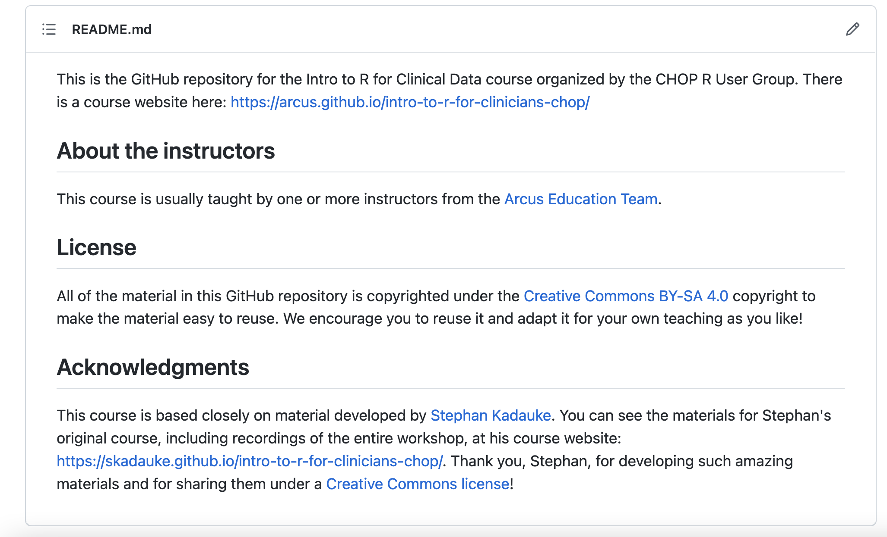<!-- style = "max-width:800px; border: 1px solid;" -->

#### Updating Your Repository: First Method

--{{0}}--
You may have noticed the pencil icon above the README file.  It appears above any text file that you can edit in the browser.  In your own repository, please click on the pencil icon above your README.md file and you'll enter the GitHub editor.

--{{1}}--
Keep in mind that we are only going to update files from the browser today.  Yes, you may already know that you can synchronize this repository to your local machine, your laptop or desktop, and make changes there instead.  But for today, we're only going to work in the browser.  

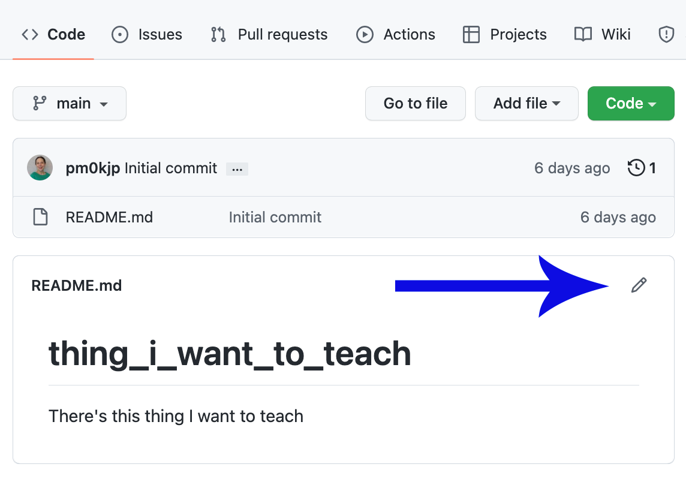<!-- style = "max-width:400px; border: 1px solid;" -->  
<!-- style = "max-width:600px; border: 1px solid;" -->  

#### Edit and Preview: First Method

--{{0}}--
This is what the default GitHub editor looks like.  You'll notice that it has an "Edit file" tab as well as a "Preview" tab.  Go back and forth between those two tabs.  You'll notice that the top line, the one with the single hash mark, renders in large text in the preview.  The hash mark is a special mark that indicates that the text should be a header when the document is displayed, or "rendered".  Special marks like these constitute markdown, which is the topic for the next section of our workshop.

--{{1}}--
Go back to the "Edit file" tab and update the text there.  Change the top line to a nicer title for your document.  Maybe you want to remove any underscores or dashes, for example.  You may also want to add a sentence or two describing your plans for the repository.  When you want to check what it will look like, go to the Preview tab and take a peek at how the text will render.

<!-- style = "max-width:900px;" -->

#### Saving Files and Committing: First Method

--{{0}}--
When you're happy with your changes, scroll toward the bottom of your page and you'll see an area that is devoted to recording a "commit message".  A "commit" creates a version of code you want to save, so that you can always remember what your files looked like at that point in time.  Committing in GitHub records who you are, the date and time, and what changed in the files.  When you add a good description of what changed, that gives you a reminder of the "why" behind the changes as well.

--{{1}}--
You will be provided with a pretty poor default message that just says "Update README.md".  Put something a bit more descriptive there, as I have in this image.  

--{{2}}--
One thing we don't have time to get into is the use of branches in git.  For now, we're going to commit everything directly to the "main" branch.  Eventually, you'll want to use other branches and use a style of updating called "[GitHub flow](https://docs.github.com/en/get-started/quickstart/github-flow)".  But for now, we'll just commit to main.  

--{{3}}--
Go ahead and add a more useful commit message and click the green "Commit Changes" button to make your first commit!

<!-- style = "max-width:10 00px;" -->

#### Getting Back to Repository View

--{{0}}--
After making your commit, you'll be shown the page in GitHub corresponding to the file you changed.  To get back to the repository level, click on the repository name.  Here I've pointed to my repository name with orange arrows.

--{{1}}--
What will happen, do you think, if I were to click on my username, pm0kjp?  Yep, that's right, it would take me to my account home, which would allow me to look into any of my repositories.

<!-- style = "max-width:800px; border: 1px solid;" -->

#### Adding a File: First Method

--{{0}}--
What if you want to add, say, an image to a repository?  Take a moment and find an image on your computer that you don't mind uploading to a public place.  If you don't have one, I suggest going to AMIA.org, then going to the bottom of the page and right clicking to save the AMIA logo to your computer.  I'm sure they'll forgive us this potential misuse of their logo!

--{{1}}--
Does everyone have an image they're ready to upload?  Great!  You're now going to look in your repository page and click on the "Add File" button, choosing the "Upload files" option.  You'll see this uploader.  Go ahead and add your file, give a good commit message, and commit your changes!

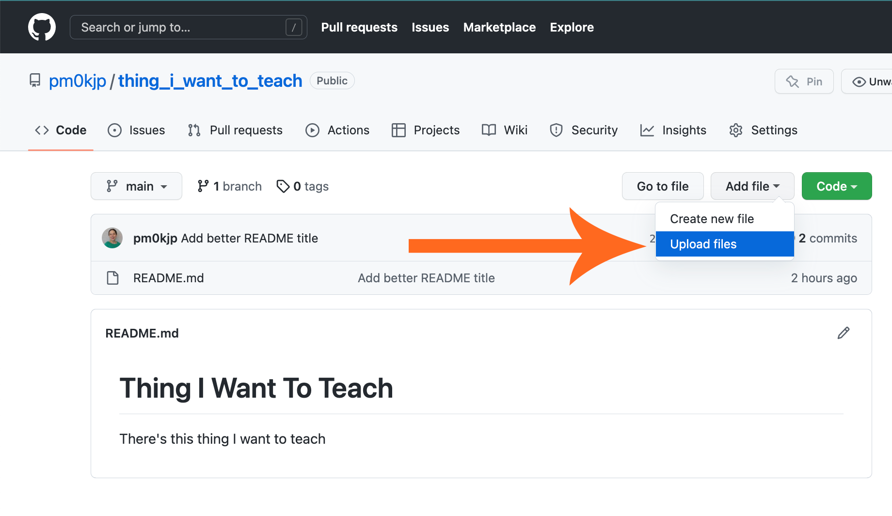<!-- style = "max-width:400px; border: 1px solid;" -->  
<!-- style = "max-width:400px; border: 1px solid;" -->  

#### Updating Your Repository: Second Method

--{{0}}--
For about a year, GitHub has offered another method to update your repository.  Go your **repository page** (click on your repository name to get there), and then, on your keyboard, type a period.  

--{{1}}--
That will open github.dev.  In fact, you can also just change the .com in your repository home page to .dev to get the same view:

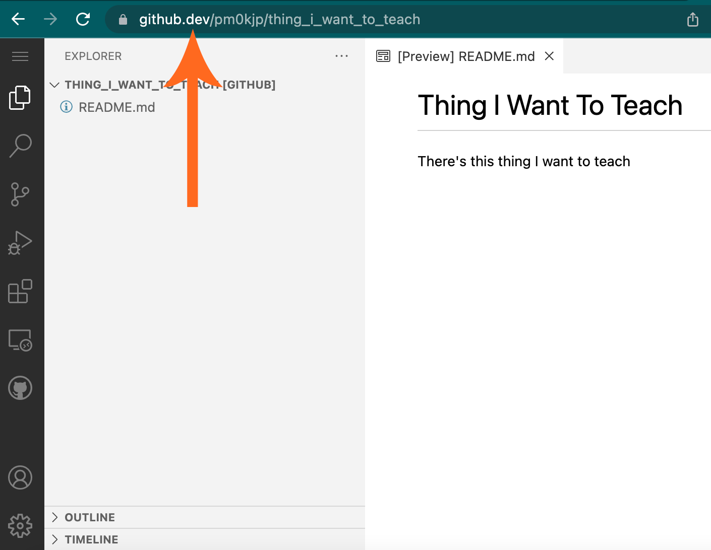<!-- style = "max-width:500px; border: 1px solid;" -->  

#### Edit and Preview: Second Method

--{{0}}--
In the left pane, you can see an Explorer that includes the name of your repository.  If you expand your repository name, you can click on a file name and open an editor.  

--{{1}}--
Then, you can click on the icon indicated here with the orange arrow to open up a live preview in a separate pane.

--{{2}}--
Please do that and make an additional change or two to your README.md file.  This time, we're going to wait before making a commit.  You can see that you have some un-committed changes in the menu on the left.  Do you see the blue dot with the number 1?  That represents one changed file with uncommitted changes.

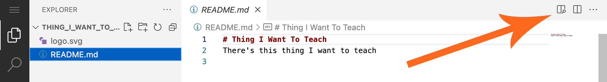<!-- style = "max-width:800px; border: 1px solid;" -->  

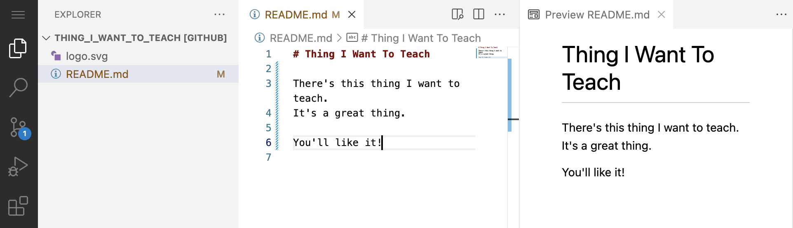<!-- style = "max-width:800px; border: 1px solid;" -->  

#### Adding a File: Second Method

--{{0}}--
Now we're going to add a new file by clicking the new file icon that appears when you hover over your repository name.  Do that and give your new file the name "info.txt" in the file name box.  Hit enter to create the empty new text file.  Add a few lines of text -- I put my shopping list here!

--{{1}}--
You'll now see that the blue number on the left menu reads "2", for two uncommitted files.  Time to commit both of these changes as a new version!

<!-- style = "max-width:300px; border: 1px solid;" -->  
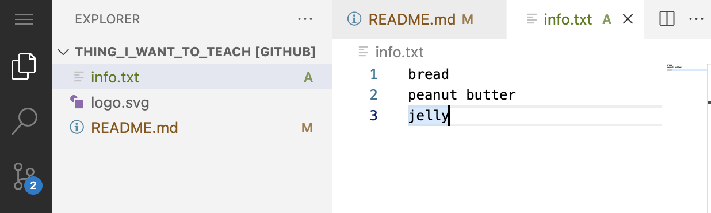<!-- style = "max-width:600px; border: 1px solid;" -->  

#### Saving Files and Committing: Second Method

--{{0}}--
If you hover over the menu item with the blue number, you'll see that the icon is for "Source Control" and it reports two pending changes.  After hovering over this icon to read the helpful label, go ahead and click it.

--{{1}}--
You'll see your two changes listed below an empty box that is waiting for a commit message.  Type a helpful message for your commit, and then click the check mark above the commit message box to commit your changes.

<!-- style = "max-width:400px; border: 1px solid;" -->  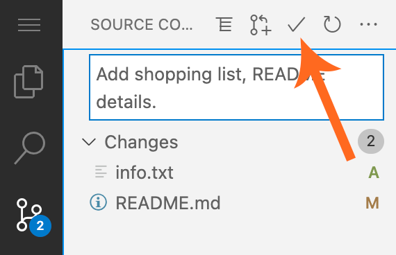<!-- style = "max-width:400px; border: 1px solid;" -->  

#### Get Back to GitHub

--{{0}}--
To get back to your normal GitHub repository, you can either change ".dev" to ".com" in the URL, or you can click on the "burger" menu (three lines) in the upper left and choose "Go To Repository".

<!-- style = "max-width:500px; border: 1px solid;" -->

### Forking an Existing Repository

--{{0}}--
Sometimes you want to copy an existing project and use it as the starting point for your own work.  This is called "forking" a repository.  You fork a repository when you copy someone else's repository in order to make it your own and tailor it to your use case.  That's what we're going to do today in the creation of your fork of our "peanut butter and jelly" repo.

--{{1}}--
Please go to https://github.com/arcus/pbj and click on the "fork" button at the top.  You'll see a form like the one on your screen.  Please click on "Create Fork".

<!-- style = "max-width:500px; border: 1px solid;" -->  <!-- style = "max-width:500px; border: 1px solid;" -->  

#### Looking at Your Fork

--{{0}}--
Now you'll have your own copy, taken at this point in time.  This represents a "fork" in the road, which is why we call this "forking".  The repository you copied may continue to grow and change in one direction while you make your copy do something else entirely, changing it in different ways.  It's important to realize that your fork of the PBJ repo is separate from the original... what you do on your copy won't affect the original, and changes to the original won't affect your copy.  

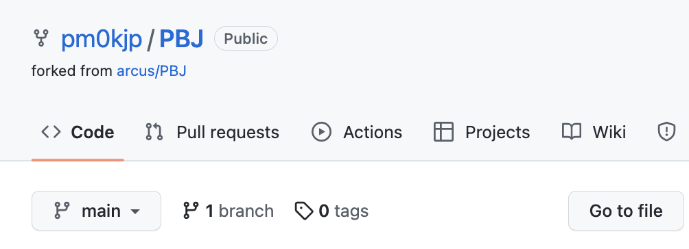<!-- style = "max-width:500px; border: 1px solid;" -->
