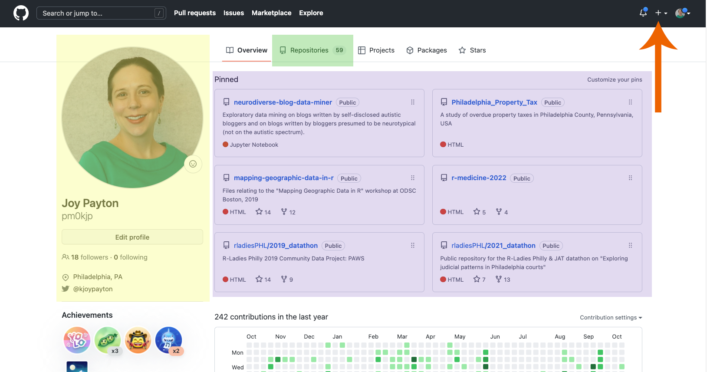

<!--
title: GitHub
mode: Slides
-->

## Logging into GitHub

First step: go to <https://github.com> and either:

* login (if you have an account)
* create an account (it's free!)

## Your Account Homepage

* Biographical Information
* Pinned Repositories (Repos)
* Repositories Tab
* Add a New Repository Button

### Git is Version Control

Not Git:

<!-- style = "max-width:400px" -->

Git:

#### Text Files: Git's Specialty

Text files:

* .txt files
* Computer code
* Configuration files
* Plain text data (.json, .csv)
* Markup/Markdown (.xml, .yaml, .md)
* Anything that is encoded as plain text

Not text files:

* Microsoft Word
* .pdfs
* image files
* PowerPoint
* Anything that if you open it in a text editor looks like scrambled nonsense

### Git in GitHub

“git” is a command line tool, a program that uses a set of rules that governs how the Git version control system works. You can use it by itself and do everything you need to, if you’re comfortable working on the command line. Lots of people do just that!

While Git by itself is great at version control and keeping track of your changes, GitHub wraps all of the sometimes complex inner workings of Git into a visually pleasing, easy to understand user interface. Instead of having to learn a bunch of command line tools, GitHub (both the website as well as the client software you can run on your computer) allows you to see things like version history, file change summaries, etc., very simply. It’s fairly intuitive for most day-to-day uses.

GitHub (the website) is a also place for your files to live with version control applied to them, so you can think of it as a souped-up remote server. That means it’s great not only for version control (which you could just do on your local computer using a git-enabled product like GitHub Desktop), but also having a central hub for all your files that you and your collaborators can use as the canonical source of the best, most up-to-date files.

## Creating a Repository in GitHub

* Create a Repository
* Editing files in-browser
* The special role of README.md
  - README
  - md
* Preview, especially great for md
* Saving Files and Committing
* Yes there are other ways but this is our way today.
  - In day to day work, you'll want to do your edits and commits in your local computer.  multiple files in a single commit, etc.
* Raw and rendered: what’s the difference?
* Add an image file

## Forking a Repository in GitHub

Once you're logged in to Github, you're going to fork a repository.  **Forking** means making a copy of an existing repository with the idea that you'll take the repository and run with it in your own direction, doing your own stuff and making it suit your needs.  Think of a "fork in the road".  You are making your own path forward from the starting point of an existing repository.

Sometimes, forks hew pretty closely to what the original repository did and try to apply improvements to the original repository.  In a case like this, the forked repository can be a source of suggested material for the original repository.  We won't use this model today, but it's helpful to remember that sometimes a forked repository runs pretty parallel to the original, and its users aren't trying to do something new and different.

* Forking our PBJ
