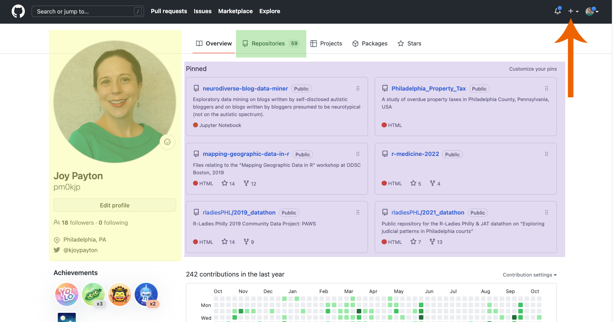
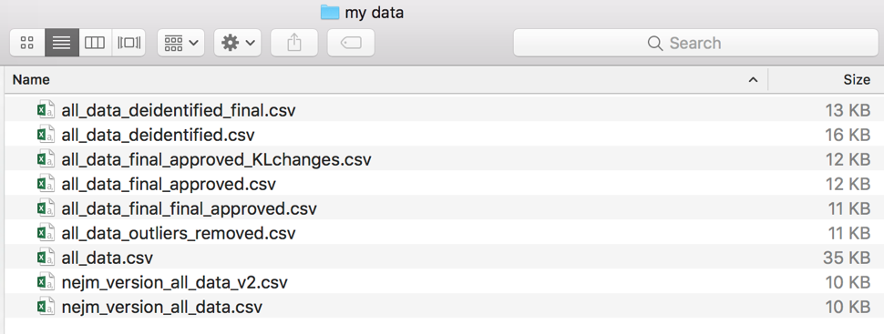

##  Logging into GitHub

First step: go to <https://github.com> and either:

* login (if you have an account)
* create an account (it's free!)

GitHub is a website that provides storage for git repositories (we'll explain this a bit more) as well as some helpful add-ons that are often used by software developers.  You may or may not use these helpful add-ons such as issues, pull requests, projects, etc.

## Your Account Homepage

Let's take a look at some of what you might see on your Git account homepage.  Here is my GitHub account homepage!

* In the yellow highlighted area, you can see biographical information, which you can optionally add if you want.
* In the purple box, here are some of my pinned repositories, which are the ones I want easily visible for fast access.  A repository is a directory of files all related to a single project.  
* In green, at the top, we see the "Repositories" tab, where I can see all 59 of my repositories.
* And finally, if you follow the orange arrow on the right side, you can see a plus button which will allow me to add a new repository.

If you think of the word *hub* as referring to a central place for something, you might realize that "GitHub" is a central place for "git".  But... what's git?  Before we start diving into this website, what is it all about?

### Git is Version Control

Git is the technical industry standard for version control.  Version control exists in order to give you access to any version of a text file (usually code or configuration files) at any time, with helpful messages that tell you why things changed and by whom. Often, a scientist’s first form of version control is something like this first image:

If you have a file system that looks like this, with clues embedded in file names, you have a crude (and large, and hard to work with) version control system already. You probably have to say things like “no, it’s the one with the time stamp in March, remember, because in April that was the one that says ‘final’ but it’s not really …”. Maybe you’re afraid to throw any of the files away because you’re not 100% sure you remember exactly why you made that particular version, but you’re a little chagrined that you have 10 versions of (mostly) the same .csv. If your files are large, you might have a storage problem as well!

And what about your clinical or research collaborators? Are you sending these files back and forth over email for each member to make changes? What if someone accidentally works on a version that doesn’t include the changes of another collaborator? Working by committee is hard when you rely on local copies. Maybe you have just one copy on a server that everyone has access to, which is better. But while you have the file open, your assistant or co-PI can’t make changes. Frustrating!

Good news! There is a better way to do version control. While there are several methods out there (e.g. Subversion), Git has won the market.

Git helps you track changes in your text (more on this later) files.  Specifically, Git will help you track the version of your files and keep records of:

* What changed
* When it changed
* Who changed it
* Why they changed it

Not only does Git keep a record of this, but it allows you to go back in time and recapture things you deleted or changed and now have second thoughts about.  This is great because it keeps you from hoarding multiple versions of a file, which fill up your hard drive and also give you heartburn when you have to comb through them to find that one thing you are looking for.

Now, earlier, we said that Git helps track changes in **text** files.  What did we mean by that?

#### Text files

Git helps you track changes in your text files.  By "text" here we mean files that are encoded in plain text, like .txt files, computer code like Python files, configuration files, data files like .json and markdown/markup files like .xml or .yaml.  Specially formatted "word processing" documents like Microsoft Word or .pdf documents aren't encoded in plain text and aren't "text files" in this sense.  Why does this matter

### Git in GitHub

“git” is a command line tool, a program that uses a set of rules that governs how the Git version control system works. You can use it by itself and do everything you need to, if you’re comfortable working on the command line. Lots of people do just that!

While Git by itself is great at version control and keeping track of your changes, GitHub wraps all of the sometimes complex inner workings of Git into a visually pleasing, easy to understand user interface. Instead of having to learn a bunch of command line tools, GitHub (both the website as well as the client software you can run on your computer) allows you to see things like version history, file change summaries, etc., very simply. It’s fairly intuitive for most day-to-day uses.

GitHub (the website) is a also place for your files to live with version control applied to them, so you can think of it as a souped-up remote server. That means it’s great not only for version control (which you could just do on your local computer using a git-enabled product like GitHub Desktop), but also having a central hub for all your files that you and your collaborators can use as the canonical source of the best, most up-to-date files.

## Creating a Repository in GitHub

* Create a Repository
* Editing files in-browser
* The special role of README.md
  - README
  - md
* Preview, especially great for md
* Saving Files and Committing
* Yes there are other ways but this is our way today.
  - In day to day work, you'll want to do your edits and commits in your local computer.  multiple files in a single commit, etc.
* Raw and rendered: what’s the difference?
* Add an image file

## Forking a Repository in GitHub

Once you're logged in to Github, you're going to fork a repository.  **Forking** means making a copy of an existing repository with the idea that you'll take the repository and run with it in your own direction, doing your own stuff and making it suit your needs.  Think of a "fork in the road".  You are making your own path forward from the starting point of an existing repository.

Sometimes, forks hew pretty closely to what the original repository did and try to apply improvements to the original repository.  In a case like this, the forked repository can be a source of suggested material for the original repository.  We won't use this model today, but it's helpful to remember that sometimes a forked repository runs pretty parallel to the original, and its users aren't trying to do something new and different.

* Forking our PBJ
